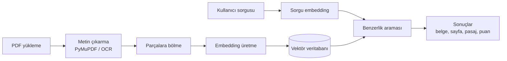

[README.md](https://github.com/user-attachments/files/33103588/README.md)
# PDF Belgelerinde Anlamsal Arama Yapabilen Doküman Yönetim Sistemi

Fırat Üniversitesi Bilgisayar Mühendisliği Tasarım dersi kapsamında geliştirilen takım projesi.

> **Durum:** Proje planlama aşamasındadır. Aşağıdaki mimari ve teknolojiler planlanan yapıyı gösterir, geliştirme ilerledikçe güncellenecektir.

## Proje Hakkında

Klasik arama yöntemleri yalnızca sorgudaki kelimelerin belgede birebir geçip geçmediğine bakar. Kullanıcı aradığı bilgiyi farklı kelimelerle, eş anlamlı ya da farklı çekimlenmiş sözcüklerle ifade ettiğinde ilgili sonuçlar gözden kaçar. Türkçe gibi eklemeli dillerde bu sorun daha da belirgindir.

Bu proje, PDF belgelerinin yüklenip yönetilebildiği ve bu belgelerde **anlama dayalı arama** yapılabilen bir sistem geliştirmeyi amaçlar. Kullanıcı sorusunu doğal bir cümleyle yazar, sistem anlamca en ilgili pasajları belge adı, sayfa numarası ve benzerlik puanıyla birlikte listeler.

## Hedefler

- PDF dosyalarından sayfa bilgisi korunarak metin çıkarma, taranmış sayfalar için OCR desteği
- Türkçeyi destekleyen bir embedding modeliyle anlamsal arama
- Test kümesinde doğru pasajın ilk 5 sonuç içinde yer alma oranının (Recall@5) en az %80 olması
- İndekslenmiş yaklaşık 1000 sayfalık koleksiyonda sorgu yanıt süresinin ortalama 1 saniyenin altında olması
- Belge listeleme, etiketleme, silme ve yeniden indeksleme
- Sonuçların pasaj vurgulanarak gösterildiği web arayüzü

## Nasıl Çalışacak

1. **Metin çıkarma:** Yüklenen PDF'lerden metin sayfa sayfa çıkarılır. Metin katmanı olmayan sayfalar OCR ile işlenir.
2. **Parçalara bölme:** Metin, birbiriyle kısmen örtüşen küçük parçalara ayrılır. Her parça belge ve sayfa bilgisiyle saklanır.
3. **Embedding:** Her parça, anlamını temsil eden bir vektöre dönüştürülür.
4. **İndeksleme:** Vektörler vektör veritabanına kaydedilir.
5. **Arama:** Sorgu da vektöre çevrilir ve kosinüs benzerliğiyle en yakın parçalar bulunur. Anahtar kelime aramasıyla (BM25) birleştirilen hibrit arama da denenecektir.

## Planlanan Teknolojiler

| Katman | Teknoloji |
|---|---|
| Arka uç | Python, FastAPI |
| PDF işleme | PyMuPDF, Tesseract OCR |
| Embedding | sentence-transformers (paraphrase-multilingual-MiniLM-L12-v2 veya multilingual-e5) |
| Vektör veritabanı | FAISS veya ChromaDB |
| İlişkisel veritabanı | SQLite veya PostgreSQL |
| Ön yüz | React (prototip için Streamlit) |

## Ekip

| Adı Soyadı | Görevi |
|---|---|
| Gurbet Fidan | Backend geliştirme: PDF işleme modülü ve arama API'si |
| Onur Can Sarı | Anlamsal arama: embedding modeli, vektör indeksleme ve performans testleri |
| Elif Gül Söylemez | Ön yüz geliştirme: kullanıcı arayüzü, belge yönetimi ekranları ve test kümesi |

## İlerleme

- [x] Problem tanımı ve literatür taraması
- [x] Sistem mimarisi ve teknoloji seçimi
- [x] İş paketleri ve görev dağılımı
- [ ] PDF işleme modülü
- [ ] Embedding ve vektör indeksleme
- [ ] Arama servisi ve API
- [ ] Kullanıcı arayüzü
- [ ] Test ve performans değerlendirmesi

## Kurulum

Kurulum adımları, kod geliştirildikçe bu bölüme eklenecektir.

## Temel Kaynaklar

- Reimers, N., & Gurevych, I. (2019). [Sentence-BERT: Sentence Embeddings using Siamese BERT-Networks](https://aclanthology.org/D19-1410.pdf). EMNLP-IJCNLP 2019.
- Reimers, N., & Gurevych, I. (2020). [Making Monolingual Sentence Embeddings Multilingual using Knowledge Distillation](https://aclanthology.org/2020.emnlp-main.365.pdf). EMNLP 2020.
- Karpukhin, V. ve diğerleri (2020). [Dense Passage Retrieval for Open-Domain Question Answering](https://aclanthology.org/2020.emnlp-main.550.pdf). EMNLP 2020.
- Thakur, N. ve diğerleri (2021). [BEIR: A Heterogenous Benchmark for Zero-shot Evaluation of Information Retrieval Models](https://arxiv.org/pdf/2104.08663). NeurIPS 2021.

Kaynakların tam listesi proje raporunda yer almaktadır.
